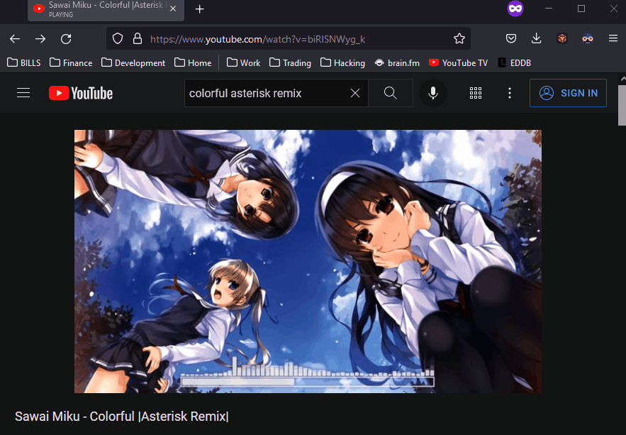
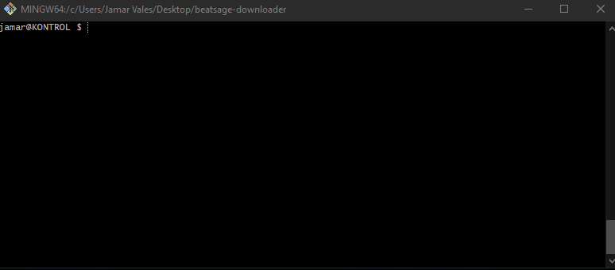
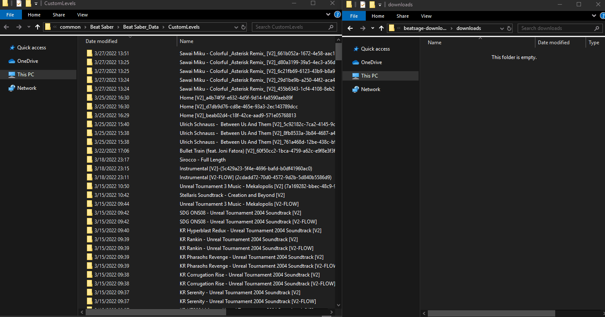

# BEATSAGE DOWNLOADER

This is a little experimental project created to generate custom beatsaber maps using BeatSage through automation using good ol' Puppeteer sweet sauce.

### "I put that \*\*\*\* on everything" XD

** NOTE ** - I do not condone the use of this software for spamming/abusing services. This is for experimental purposes only. The code has a hard limit set on the number of simultaneous downloads and shouldn't be modified for abuse. Be nimble and respect their servers.

## Usage:

Since I was too lazy to learn proper github markdown and create an official CLI lib to work around the windows mess, this will suffice.

Hey, I'm an engineer. I just make it work... okay: here's the CLI in play.

---

### Get the link! Obvi!

---

### Next, CLI will ask a few questions about how you want it set up. After that, you can paste links and the app will queue and start to download the map whenever a downloader agent is available. The settings used here will be used on all maps downloaded ~~ (OuO) <3

Also: I enabled puppeteer with headless set to false to demonstrate what is happening under the hood.

---

### And finally! The app will download, extract and place the map where your custom levels are.... oh, and clean itself up, of course ;) .... Yay'uh!!! - Now we can weeb out to our hearts' desire =P

---

### I guess I'll throw in a little sum' sum' for y'all... Here's a little video demonstrating it.

## .

# Life is only short if you don't learn to let go.

Enjoy it! Be lively!
